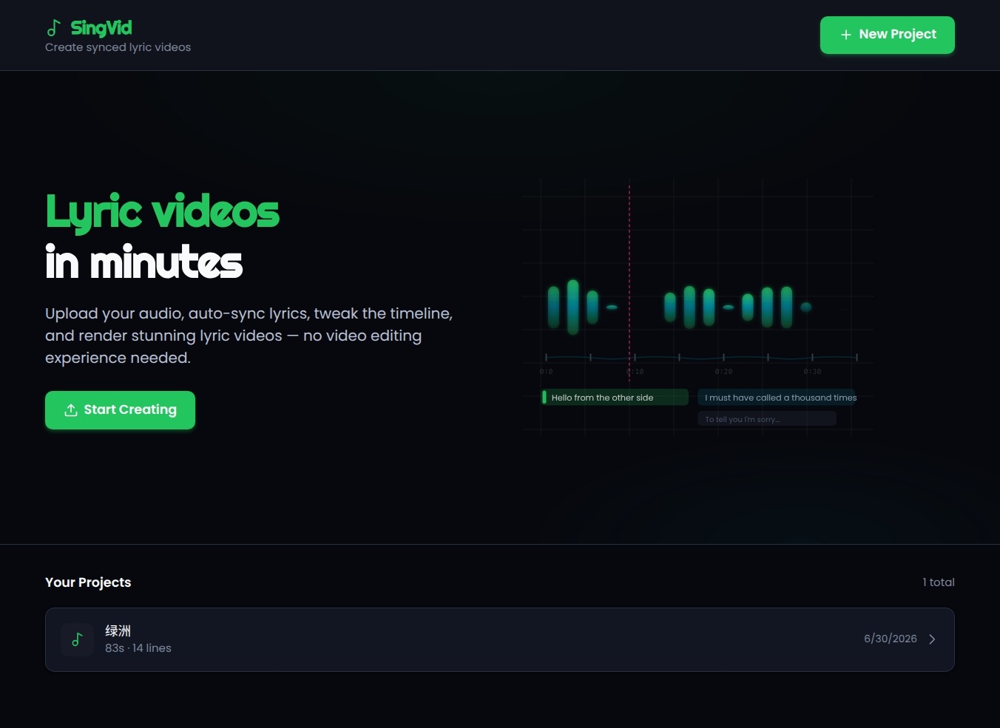

# Singing Video Generator



## 简介

**Singing Video Generator** 是一个利用你自己的录音，自动生成歌词/演唱视频的在线工具。上传一段人声或音乐录音，选择喜欢的视觉模板，即可快速生成一条带有歌词字幕和动态画面的视频。

适合用于翻唱展示、社媒短视频、音乐 Demo、练唱记录等场景。

## 核心功能

- **录音上传** — 支持 MP3、WAV、M4A、OGG 等常见音频格式
- **智能转写** — 自动识别录音中的歌词/语音内容
- **时间轴对齐** — 将歌词行精确对齐到录音的时间位置
- **多模板选择** — 可选不同的视觉风格与排布方式
- **视频渲染** — 基于 Remotion 引擎生成高质量 MP4 视频
- **成品下载** — 一键下载渲染完成的视频文件

## 使用流程

1. 创建一个项目，上传你的录音文件
2. 选择录音的语言，启动转写（自动生成歌词文本）
3. 根据需要编辑歌词，或使用时间轴对齐工具精调
4. 选择一个喜欢的视觉模板
5. 点击渲染，等待视频生成
6. 下载最终的 MP4 视频

## 本地运行

项目基于 Next.js（Web 端）+ Python（后台 Worker）架构，使用 Docker Compose 一键启动：

```bash
docker compose up --build
```

Web 服务默认运行在 `http://localhost:3000`。
