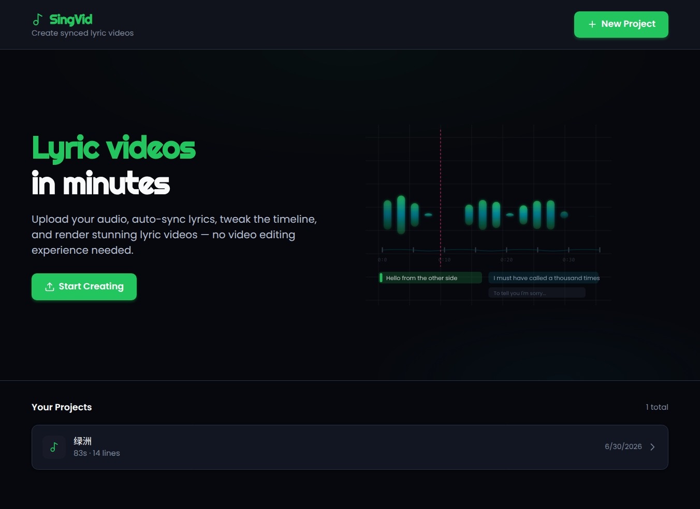
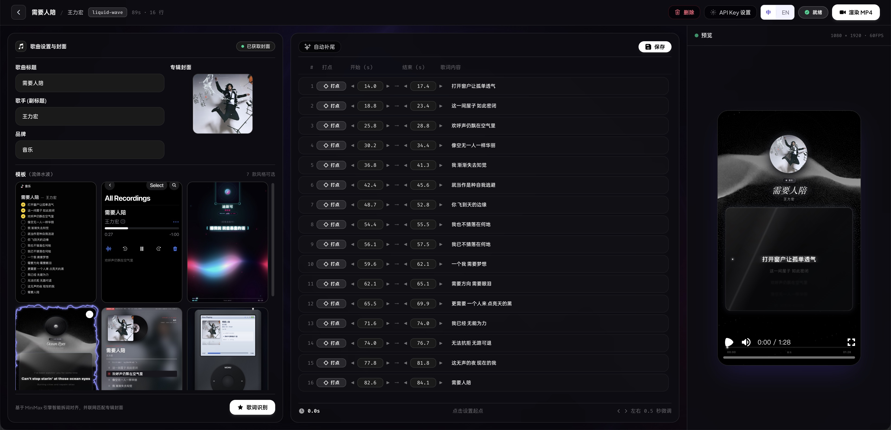
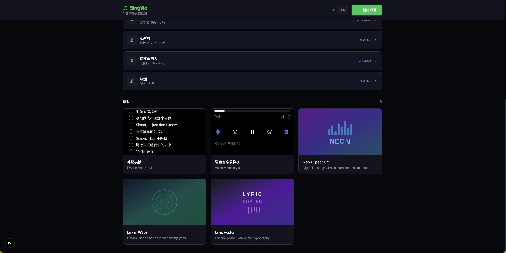
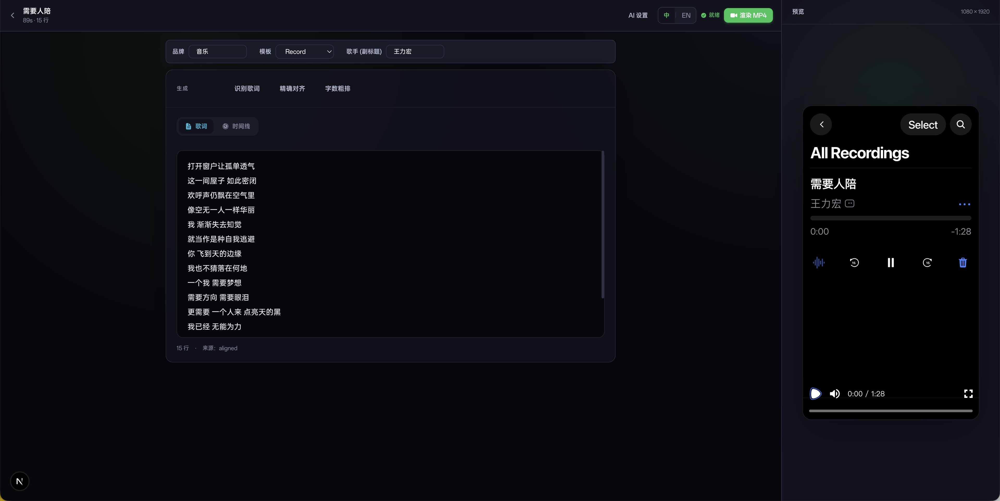
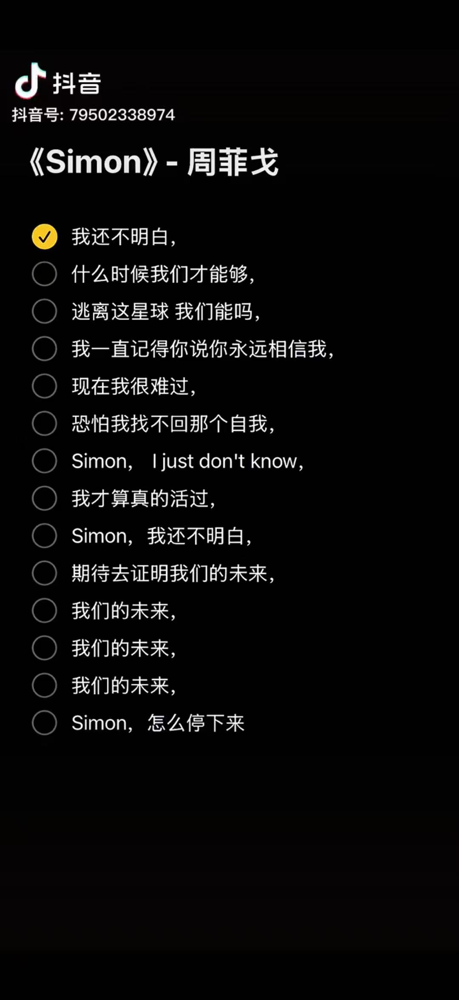

# Singing Video Generator



## 简介

**Singing Video Generator** 是一个利用你自己的录音，自动生成歌词/演唱视频的在线工具。上传一段人声或音乐录音，选择喜欢的视觉模板，即可快速生成一条带有歌词字幕和动态画面的视频。

适合用于翻唱展示、社媒短视频、音乐 Demo、练唱记录等场景。

## 核心功能

- **录音上传** — 支持 MP3、WAV、M4A、OGG 等常见音频格式
- **歌词识别** — 自动识别歌词文字，并对齐到录音的时间位置
- **时间线校准** — 逐行微调时间，文字与时间线同源同步
- **多模板选择** — 可选不同的视觉风格与排布方式
- **视频渲染** — 基于 Remotion 引擎生成高质量 MP4 视频
- **成品下载** — 一键下载渲染完成的视频文件

<p align="center">
  
</p>

## 使用流程

1. 创建一个项目，填写歌曲名与歌手，上传录音文件
2. 点击「识别歌词」，自动生成歌词与时间线
3. 切到「时间线」微调时间或修正文字
4. 选择一个喜欢的视觉模板
5. 点击渲染，等待视频生成
6. 下载最终的 MP4 视频

<p align="center">
  
</p>

## 架构

单个 Next.js 服务，无本地机器学习依赖：

```
┌────────────────────────────────────────────────────────────┐
│  web/  (Next.js)                                           │
│  项目管理、上传、歌词识别、时间线校准、预览、渲染调度          │
│  独占 SQLite                                                 │
└──────┬──────────────────────────────┬──────────────────────┘
       │ HTTP                         │ HTTP
       ▼                              ▼
┌────────────────────┐      ┌──────────────────────┐
│ MiniMax ASR        │      │ 歌词库 (api.lrc.cx)   │
│ 本录音的逐字时间戳   │      │ 准确的歌词文字         │
└────────────────────┘      └──────────────────────┘
```

识别歌词时并行使用两个来源，各取所长：

- **MiniMax ASR** 提供时间轴 —— 它识别的是**你自己唱的这版录音**，逐字给出时间戳
- **歌词库** 提供歌词文字 —— 语音识别在歌唱场景下错字多，歌词库的文字才是准的

歌词库自带的时间轴会被丢弃：那对应的是原版录音，与你的演唱速度、编曲都不同。歌词文字通过**拼音对齐**映射到 ASR 的时间戳上 —— 拼音层不受简繁差异影响（`听` / `聽` 同为 `ting`）。

歌词库未命中、或匹配度过低时，降级为「ASR 原文 + LLM 断句」，并会在界面上提示歌词可能有错字，需要手动校正。

## 外部服务

本项目依赖以下第三方服务，使用前请了解各自的条款：

| 服务 | 用途 | 说明 |
|---|---|---|
| [MiniMax 开放平台](https://platform.minimaxi.com/) | 语音识别（`/v1/speech_to_text`） | 需要自备 API Key，按音频时长计费；单次上限 500 秒、50 MB。歌词库未命中时还会调用其文本模型做断句 |
| [api.lrc.cx](https://api.lrc.cx/) | 歌词库 | 公开接口，无需认证。用于获取准确歌词文字；其自带的时间轴不被采用 |

音频会上传至 MiniMax 用于识别，歌曲名与歌手名会发送至歌词库查询。API Key 仅保存在浏览器 `localStorage`，不会写入数据库。

## 本地运行

### 前置要求

- Node.js 18+ 与 npm
- MiniMax API Key（用于歌词识别）

### 启动

```bash
mkdir -p data/uploads data/renders
cd web
npm install
npx prisma db push
npm run dev
```

默认运行在 `http://localhost:3000`。首次打开后在右上角「API Key 设置」填入 MiniMax API Key。

### 功能与依赖对照

| 功能 | 依赖 | 不可用时 |
|---|---|---|
| 项目管理、时间线校准、预览、渲染、下载 | 无外部依赖 | — |
| 识别歌词 | MiniMax ASR + 歌词库 | 缺少 API Key 时自动弹出配置窗口 |

### 常见问题

- **`sqlite3.OperationalError: unable to open database file`** — 通常是没创建 `data/` 目录，或没执行 `npx prisma db push`。
- **识别报「时长超过 500 秒上限」** — MiniMax ASR 单次最长 500 秒，超出会直接拒绝而不会截断。
- **识别报「歌词库未找到」** — 该项目未填写歌手名，或歌曲太冷门。此时歌词来自语音识别，会有错字，需在时间线里手动校正。
- **时间线两行之间有空档** — 点时间线上方的「自动补尾」，会把上一行的结束时间延续到下一行开始；已经衔接或刻意重叠的行不会被改动。

## 效果示例

<p align="center">
  
</p>

<p align="center">
  
</p>

### 参考开源项目: 
- https://github.com/HisAtri/LrcApi
